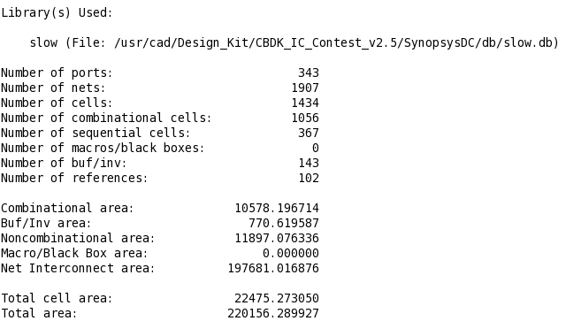
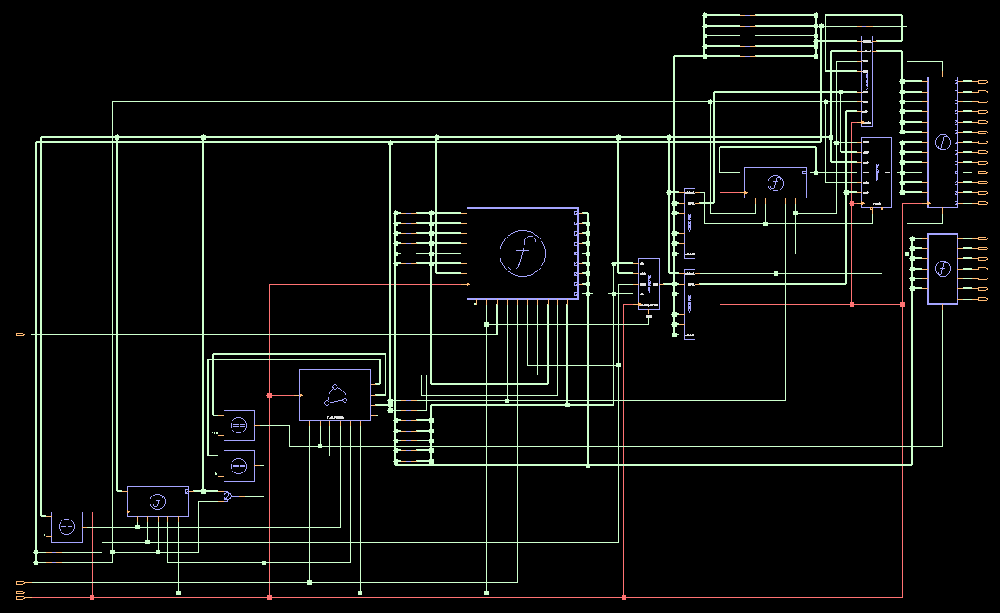
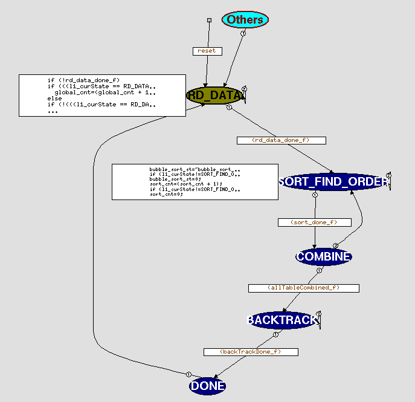

# huffman

### 解題思路：
&emsp;&emsp;用a_sequence記A1~A6的symbol跟probability，先做bubble sort，再去找combination，
找到Ci後將c_sequence的symbol跟probability寫回a_sequence，再做sort，
c_sequence存兩個index的symbol與Ci的symbol，依此類推，直到做完combination，就可以做split  
split則是用Ci的symbol左移1加1or0完成，還須搭配一個 mask_pt計算mask長度，即完成lab

- Area

  

- schematic

  

- FSM

  

