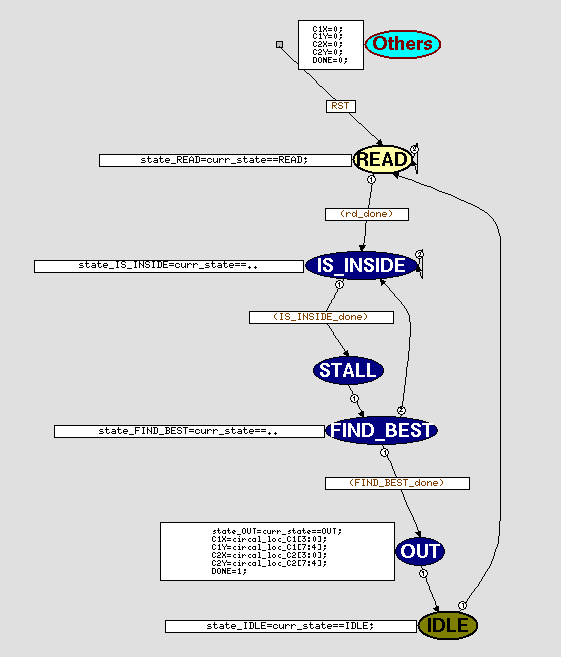
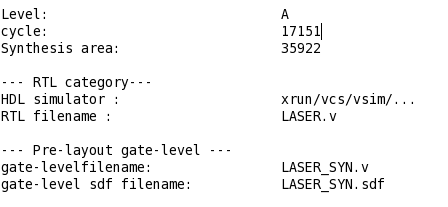
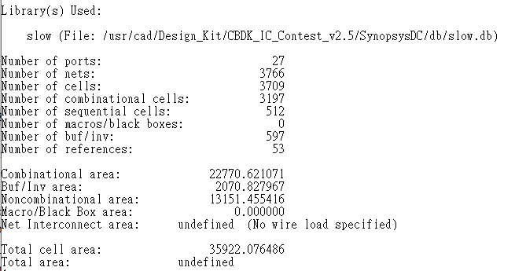
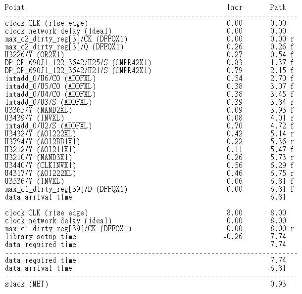
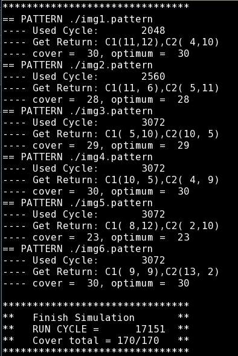
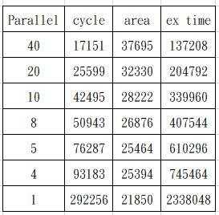

# 2023_univ_cell_B

## FSM

  

## schematic

  

## Result

  

- Area

  

- Timing

  

- Gate_level

  

- PPA

  

## dc

- dcprocheck 
check tcl correction

- dc note
https://ithelp.ithome.com.tw/articles/10231993
